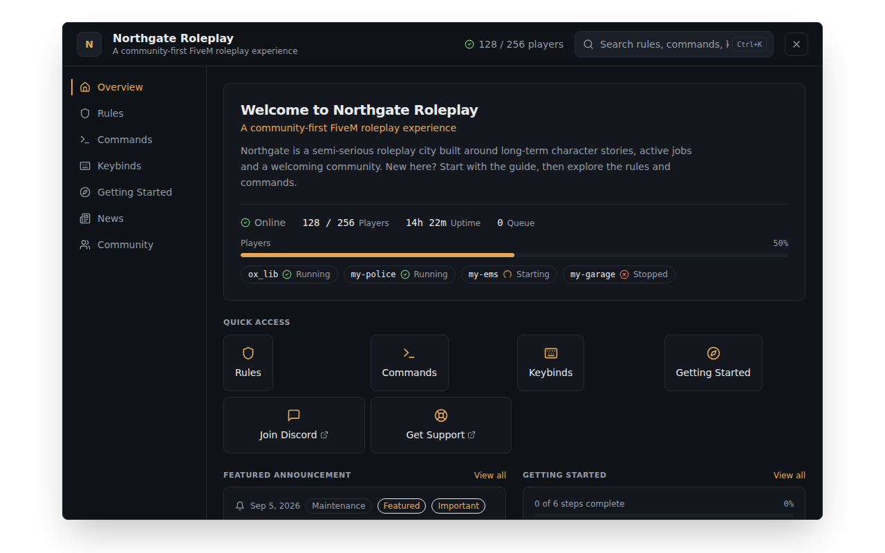
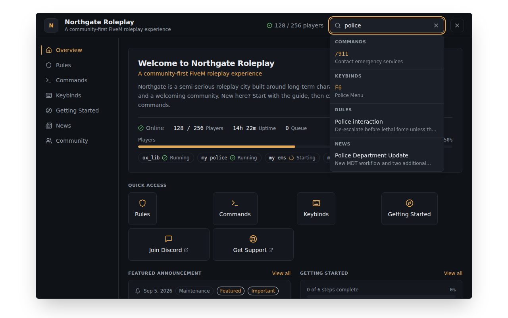
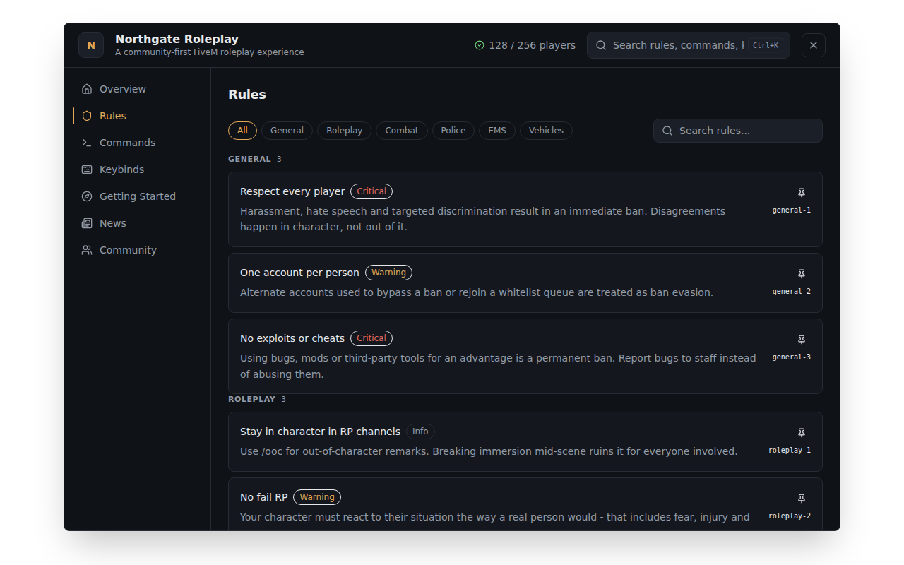
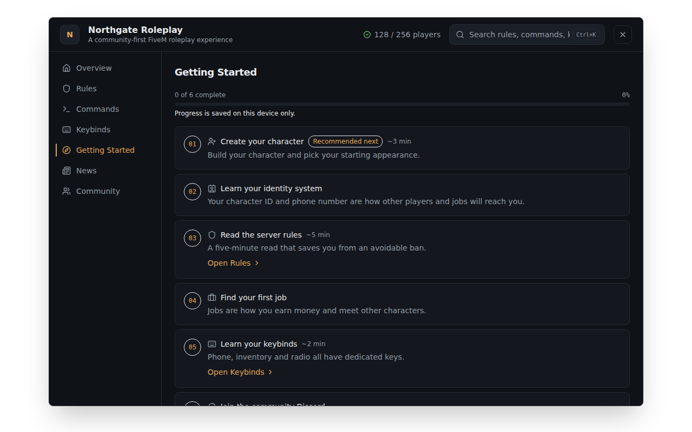

# ServerHub (`hs-serverhub`)

**An in-game information and onboarding hub for FiveM servers.**

By [HyperSentry Labs](https://github.com/HyperSentry-Labs).

Players open ServerHub with a keypress or chat command and get one clean,
searchable panel instead of hunting across Discord, pinned messages, and
loading-screen images: server rules, commands, keybinds, a guided
"getting started" flow, news/changelog, and community links - plus live
player count and server status if you want it.

It is **not** another pause menu. It doesn't touch inventory, jobs,
economy, or admin tools. It's a focused, standalone information layer that
works on any server, with or without a framework.

---

## Features

- **Overview hub** - welcome hero, live player count/status, monitored
  resource health, configurable quick actions (jump to a section, or open
  Discord/your website externally), the latest (or featured) announcement,
  a getting-started progress card, pinned items, and a community preview.
- **Rules** - categorized, searchable, with severity badges (info/warning/
  critical) and a collapse toggle for long entries.
- **Commands** - searchable directory with categories, aliases, optional
  usage examples, and display-only permission labels.
- **Keybinds** - searchable directory with categories, plus optional
  resource/context metadata (e.g. "Resource: my-police").
- **Getting Started** - a configurable, numbered onboarding timeline with
  an optional per-player progress bar, time estimates, and a "recommended
  next step" - all local to the player's device, never server-authoritative.
- **News / Changelog** - category filter, search, newest-first, with
  optional priority (normal/important/critical) and a featured flag.
- **Community** - configurable external links, either a flat list or
  grouped sections (Community / Support / Store, or whatever you name).
- **Pinned / favorites** - players can pin any rule, command, keybind, or
  getting-started step for one-tap access from Overview. Local-only,
  resettable, never server data.
- **Cross-section search (v2)** - one search box covers rules, commands,
  keybinds, getting-started, news, and community links at once, grouped by
  section, punctuation/case-insensitive, with full keyboard navigation
  (`Ctrl+K` or `/` to focus, arrow keys, `Enter`, `Escape`) and
  click-to-navigate with a highlight on the matched row.
- **Live server status** - real player count and optional monitored-
  resource health (started/starting/stopped/unknown), pushed efficiently
  (only to open viewers, only on change - never a polling spam loop).
- **Developer API (v2)** - other resources can register *and update*
  commands, keybinds, and announcements, or set a live stat, via `exports`,
  with per-registration ownership so one resource can never edit or remove
  another's entry - see [`docs/api.md`](docs/api.md).
- **Fully standalone** - no ESX/QBCore/Qbox/ox_core/vRP dependency, ever.
- **Browser-first development** - the entire UI runs in a plain browser
  tab via a mock bridge, with realistic demo data and selectable fixtures
  (empty, long text, many items, RTL, and more) for exercising every state.
- **Rebrandable** - name, subtitle, description, logo (with an automatic
  fallback if missing), accent colors, and a full optional theme-token
  palette are config-driven - no CSS editing required.
- **Internationalized** - English (default) and Persian ship out of the
  box, with RTL support and a documented path to add more languages.
- **Never crashes on bad config** - malformed entries are skipped (or, for
  a single optional field, quietly repaired) with a console warning, never
  a broken resource. Unsafe URLs (`javascript:`, `data:`, schemeless) are
  refused everywhere a link reaches the UI.

## Screenshots

Captured from the browser development build using the fictional demo
server ("Northgate Roleplay") shipped in `web/src/mock/` - not a real
HyperSentry Labs deployment, and not representative of any real server's
player count.

| Overview | Search |
|---|---|
|  |  |

| Rules | Getting Started |
|---|---|
|  |  |

Run it yourself to see the rest (Commands, Keybinds, News, Community, RTL,
mobile widths):

```bash
npm install
npm run dev
```

then open the printed `http://localhost:5173` URL. Append `?fixture=rtl`,
`?fixture=empty`, `?fixture=many`, or `?fixture=long` to the URL to preview
other content states - see [Browser development](#browser-development).

## Installation

1. Download a release ZIP (which already includes a built `web/dist/`), or
   clone the repo and run `npm run build` yourself - see
   [Browser development](#browser-development) below.
2. Copy the `hs-serverhub` folder into your server's resources directory,
   e.g.:
   ```
   resources/[standalone]/hs-serverhub
   ```
3. Add to `server.cfg`:
   ```
   ensure hs-serverhub
   ```
4. Restart your server (or `refresh` + `ensure hs-serverhub`).

No other resource, database, or framework is required.

## Configuration

Everything is configured in **`config.lua`** - server name, branding,
theme colors, links, rules, commands, keybinds, getting-started steps,
news, and community links/groups. Non-programmers can edit it directly;
every field is commented with its purpose. Full reference:
**[`docs/configuration.md`](docs/configuration.md)**.

## Commands

| Command | Default | Configurable via |
|---|---|---|
| Open ServerHub | `/serverhub` | `Config.General.Command` |

## Keybind

| Action | Default key | Notes |
|---|---|---|
| Toggle ServerHub | `F10` | Shipped default only - players can rebind it any time under **Settings > Key Bindings > FiveM > "Toggle ServerHub"**. The default is also configurable via `Config.General.DefaultKey`. |

Escape and an in-panel close button also close ServerHub (the first
`Escape` while search has text only clears the search). A native-level
input safety net in `client.lua` guarantees the panel can never leave a
player's cursor or controls stuck, even if the web page fails to load, and
NUI focus/state is always cleaned up on resource stop or restart.

## API / exports

Other resources can add or update content at runtime without editing
`config.lua`:

```lua
exports['hs-serverhub']:RegisterCommandInfo({ ... })
exports['hs-serverhub']:UpdateCommandInfo({ ... })
exports['hs-serverhub']:RegisterKeybind({ ... })
exports['hs-serverhub']:UpdateKeybind({ ... })
exports['hs-serverhub']:AddAnnouncement({ ... })
exports['hs-serverhub']:UpdateAnnouncement({ ... })
exports['hs-serverhub']:SetStat(key, label, value)
exports['hs-serverhub']:UpdateStat(key, label, value)
exports['hs-serverhub']:RemoveEntry(kind, id)
```

Every dynamic registration is tied to the resource that created it, so
another resource can never edit or remove it by guessing the `id`. Full
reference, validation rules, and examples: **[`docs/api.md`](docs/api.md)**.

## Browser development

```bash
git clone https://github.com/HyperSentry-Labs/hs-serverhub.git
cd hs-serverhub
npm install
npm run dev      # -> http://localhost:5173, full UI, no FiveM required
```

**Windows (PowerShell)** - run the same two commands on their own lines
(PowerShell doesn't use `&&` to chain commands the way bash does):

```powershell
npm install
npm run dev
```

or, if you prefer one line: `npm install; npm run dev`.

Stop the dev server with `Ctrl+C` in the terminal it's running in.

The dev server uses a mock FiveM bridge with realistic demo data (a
fictional server, "Northgate Roleplay"), so every page, the search, and
all navigation can be reviewed and iterated on in a normal browser tab -
no GTA V required. Append a `?fixture=` query param to preview other
states: `default`, `empty`, `minimal`, `long`, `many`, `rtl`. Full
workflow, FiveM installation, devtools, and debugging notes:
**[`docs/development.md`](docs/development.md)**.

## Build instructions

```bash
npm install
npm run build     # -> web/dist/ (runs tsc -b && vite build inside web/)
```

`web/dist/` is what `fxmanifest.lua` actually loads in-game. It is not
committed to source control - build it yourself, or use the one already
included in a tagged release ZIP. Node.js is a **development-only**
dependency: the shipped resource runs from the built `web/dist/` files
and needs no Node.js on the game server itself.

## Testing

From the repository root (these proxy into `web/` automatically):

```bash
npm run typecheck   # tsc -b --noEmit
npm run lint        # eslint .
npm test            # vitest run
npm run test:lua    # both Lua suites below
```

Or run the Lua suites directly:

```bash
lua tests/lua/validate_spec.lua
lua tests/lua/registry_spec.lua
```

The Lua tests need only a plain Lua 5.4 interpreter - no FiveM runtime,
`busted`, or other dependency.

## Localization

English (default) and Persian ship out of the box, with the UI direction
(LTR/RTL) switching automatically, including search, filters, and badges.
Adding another language is a matter of copying one JSON file and
translating it - see **[`docs/localization.md`](docs/localization.md)**.

## Performance notes

- Live status is only ever pushed to players who currently have ServerHub
  open, and only when the underlying snapshot actually changed - not on a
  fixed broadcast-to-everyone timer.
- Monitored-resource health only checks the resources you explicitly list
  in `Config.Status.MonitoredResources` - never a scan of every resource.
- The production NUI bundle is a single small JS/CSS pair (roughly 228 KB
  JS / 17 KB CSS before gzip, about 69 KB / 4.5 KB gzipped, as of `0.2.0`)
  with no client-side router and no large UI framework.
- Search, filtering, and category grouping are memoized per keystroke, not
  recomputed on every render.
- No CDN or external network dependency at runtime - see
  [Compatibility](#compatibility).

## Compatibility

- **Framework:** none required. Works standalone on ESX, QBCore, Qbox,
  ox_core, vRP, or no framework at all.
- **FiveM:** `fx_version 'cerulean'`, `lua54 'yes'`.
- **Network:** offline-first after installation - no Google Fonts, no CDN
  JS/CSS, no remote icon libraries, no external APIs at runtime. Only
  user-clicked links (Discord, website, etc.) leave the game, opened by
  FiveM's CEF via standard `target="_blank"` anchors, and only if they are
  a valid `http`/`https` URL.

## Troubleshooting

| Symptom | Likely cause | Fix |
|---|---|---|
| Panel doesn't open | `web/dist/` missing or stale | Run `npm run build` inside `web/`, then `restart hs-serverhub`. |
| Console warns about a skipped or repaired entry | A `config.lua` entry is missing a required field, reuses an `id`, or has an invalid enum/URL/color | Check the warning text - it names the section and the field. See `docs/configuration.md`. |
| Player count always shows 0 | `Config.Status.Enabled` is `false`, or the server was just restarted | Confirm the config flag; the first snapshot is sent as soon as a viewer opens ServerHub. |
| Logo doesn't show | No file at the configured `Logo` path | This is expected behavior, not a bug - a monogram badge is the intentional fallback. Add a real file under `web/public/branding/` and rebuild. |
| A resource's exported command/keybind isn't showing, or an update was rejected | The `id` collides with an existing one, a required field is missing, or a different resource owns that `id` | The export call returns `false, reason` - log and check it; see `docs/api.md`. |
| A configured accent/theme color didn't apply | The value isn't a valid hex or `rgb()`/`hsl()` color | Check the console warning; invalid colors fall back to the default rather than breaking the UI. |
| Pinned items or getting-started progress reset unexpectedly | Local NUI storage was cleared (a cache-clearing tool, private/incognito-style session) | Expected - both are a per-device convenience, never server-authoritative, by design. |

## Contributing

See **[`CONTRIBUTING.md`](CONTRIBUTING.md)**.

## License

[MIT](LICENSE) - see the LICENSE file. Copyright (c) 2026 HyperSentry Labs.
